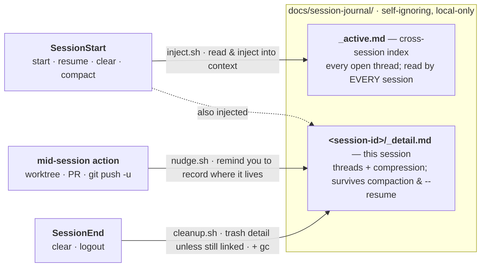

# session-journal

A **cross-session task-state journal** for Claude Code — a skill plus three hooks that make your work state survive context compaction, `/clear`, and `--resume`.

It is deliberately small: three shell hooks, one script, one skill file. No dependencies beyond `bash`, `jq`, and `git`. Your journal is plain Markdown on disk, gitignored, and never leaves your machine.

```bash
claude plugin marketplace add kai-tw/claude-plugins
claude plugin install session-journal@kai-tw
```

Then restart the session so the `SessionStart` hook fires. **Requirements:** `bash`, `jq`, `git`. Tested on macOS and Linux; on Windows use WSL or Git Bash (Claude Code runs shell hooks through Git Bash by default, so `.sh` hooks work there — native Windows with no Git Bash falls back to PowerShell, which cannot execute them).

---

## The problem it solves

Long agent sessions lose the thread. Specifically, **context compaction and `/clear` silently drop the load-bearing scaffolding** you need to keep working:

- *Which* tasks are in flight right now?
- **WHERE does each one live** — which worktree, which branch, which PR, which tracked issue?
- How do the threads relate (this one is blocked on that one)?
- What was decided, and **why**?

The harness auto-summary keeps the *gist of the conversation* but throws away exactly these facts. The classic failure: a session starts as a small bug fix in its own git worktree, drifts into planning a different feature after an auto-compaction, and the agent — no longer remembering which tree it is in — gets confused and nearly redoes shipped work.

The root cause is an **asymmetry**: reading state can be made deterministic (a hook injects it every session), but *writing* it usually relies on the model remembering to — which it doesn't, reliably. This plugin closes both sides.

## How it works



*Reading is deterministic (a hook injects state every session); writing is nudged at the moments that matter. That symmetry is the whole idea.*

**Two tiers of plain-Markdown state under `docs/session-journal/`:**

| File | Scope | Survives |
|---|---|---|
| `_active.md` | Cross-session index — every *unclosed* thread + a back-link | `/clear`, new sessions, everything |
| `<session-id>/_detail.md` | This session's full thread detail + a bounded conversation-compression block | This session's compactions + `--resume` |

**Three hooks make it deterministic:**

- **`SessionStart` → inject.** Every startup / resume / clear / compact, the index + this session's detail are injected straight into context. Reading is never left to chance. It even reads the current git branch and, when it *uniquely* matches a thread, banners "you are in *this* thread" — so a `/clear`'d worktree session resumes the right work without being told.
- **`PostToolUse` → nudge.** The single highest-value field is *where a thread lives*, and it is created mid-session — exactly when the SessionStart reminder has scrolled out of context. So a hook fires a one-shot, non-blocking reminder the moment you enter a worktree or run `gh pr create` / `git worktree add` / `git push -u`: *record where this lives now.* Writing stops being purely discretionary. (The trigger is an *invocation*, not a mention — a `grep` for the string, or a heredoc that merely contains it, is ignored.)
- **`SessionEnd` → cleanup.** On a terminal end (`/clear` / logout) the per-session detail file is trashed (recoverably) — **unless** an open thread still references it. The cross-session index always persists. Stale orphans are garbage-collected at session start, chain-aware (older members of a still-active session chain are kept).

Everything mechanical lives in one script, `scripts/journal.sh` (init / inject / cleanup / gc / list), so the hooks and the skill never drift.

## Privacy & data

The journal is **local-only**. The storage directory ignores *itself* — `journal.sh init` writes a `*` `.gitignore` inside `docs/session-journal/`, so your task notes stay out of version control without the plugin ever touching your project's own `.gitignore`. Deletion uses `trash` where available (recoverable) and falls back to `rm`. Nothing is sent anywhere; there is no network access in any script.

## Uninstall

```bash
claude plugin uninstall session-journal@kai-tw
```

Your `docs/session-journal/` contents are left in place — remove them yourself if you want them gone.

## What it is *not*

- **Not your issue tracker or plan DB.** It holds working state + pointers; link to your tracker (GitHub Issues / Linear / Jira / Notion / …), don't duplicate plan bodies here.
- **Not long-term memory.** Persistent preferences/corrections belong in your agent's memory system. This is task/thread working-state only.
- **Not a commit log.** Git owns history; the journal tracks *current* state and is updated in place.

## License

MIT — see [LICENSE](../../LICENSE).
